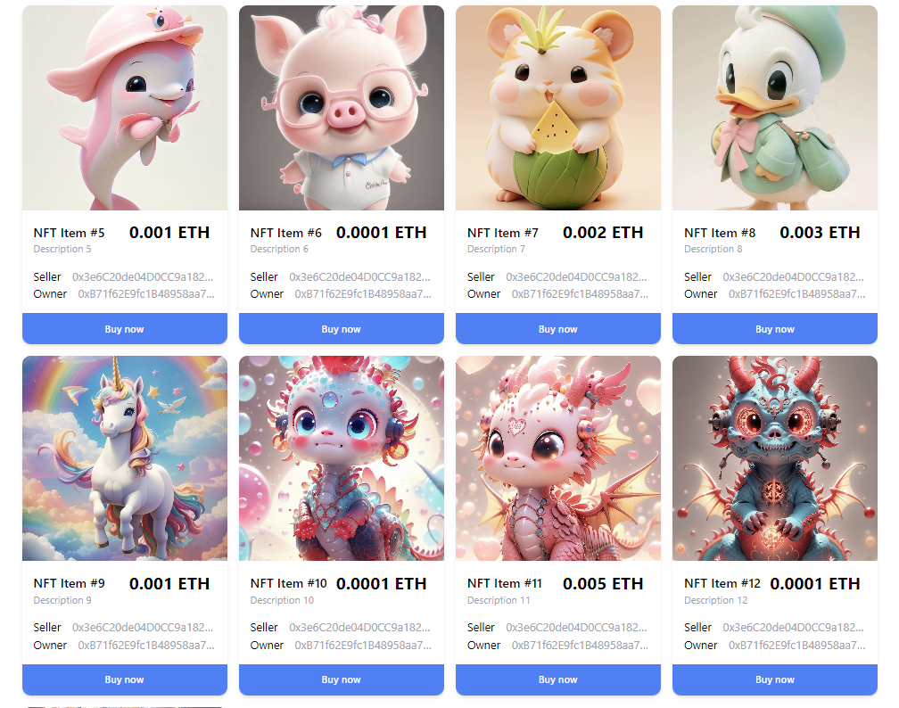

# MetaPet.vercel.app



### Running this project

#### Local setup

To run this project locally, follow these steps.

1. Clone the project locally, change into the directory, and install the dependencies:

```sh
git clone https://github.com/Petsonal/metapet.git

cd metapet

# install using NPM or Yarn
npm install

# or

yarn
```

2. Start the local Hardhat node

```sh
npx hardhat node
```

```sh
npx hardhat test
```

3. With the network running, deploy the contracts to the local network in a separate terminal window

```sh
npx hardhat run scripts/deploy.js --network localhost
```

```sh
npx hardhat run scripts/deploy.js --network sepolia
```


4. Start the app

```
npm run dev
```

### Configuration

To deploy to Polygon test or main networks, update the configurations located in **hardhat.config.js** to use a private key and, optionally, deploy to a private RPC like Infura.

```javascript
require("@nomiclabs/hardhat-waffle")
const fs = require("fs")
require("dotenv").config()
// const infuraId = fs.readFileSync(".infuraid").toString().trim() || "";
console.log("INFURA_API_KEY", process.env.INFURA_API_KEY);

module.exports = {
  defaultNetwork: "hardhat",
  networks: {
    hardhat: {
      chainId: 1337
    },
    sepolia: {
      url: `https://sepolia.infura.io/v3/${process.env.INFURA_API_KEY}`,
      accounts: [process.env.PRIVATE_KEY],
    },
    /*
    mumbai: {
      // Infura
      // url: `https://polygon-mumbai.infura.io/v3/${infuraId}`
      url: "https://rpc-mumbai.matic.today",
      accounts: [process.env.privateKey]
    },
    matic: {
      // Infura
      // url: `https://polygon-mainnet.infura.io/v3/${infuraId}`,
      url: "https://rpc-mainnet.maticvigil.com",
      accounts: [process.env.privateKey]
    }
    */
  },
  solidity: {
    version: "0.8.20",
    settings: {
      optimizer: {
        enabled: true,
        runs: 200,
      },
    },
  },
}

```

If using Infura, update **.infuraid** with your [Infura](https://infura.io/) project ID.
